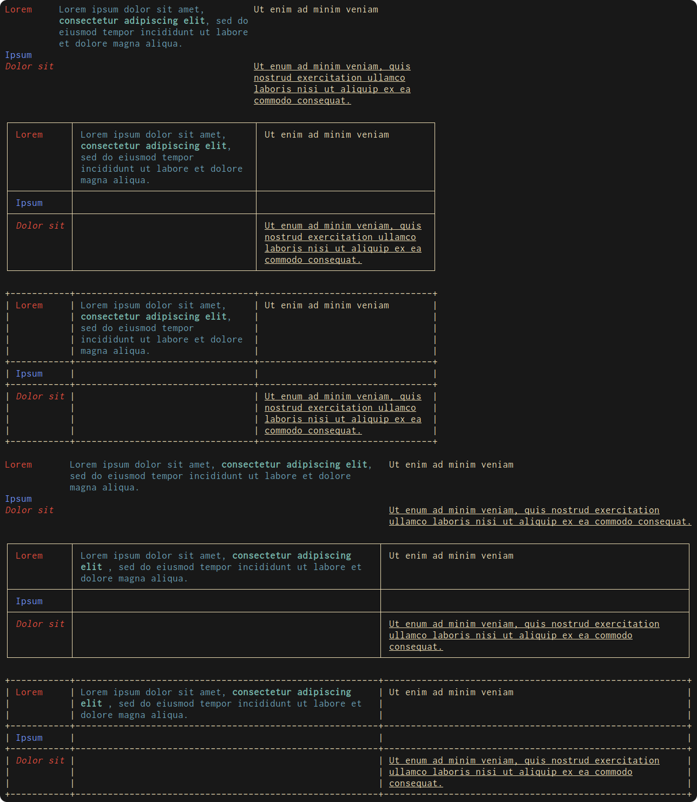

Nancy - Nim fancy ANSI tables
-----------------------------

Have you ever output data to the terminal and formatted it with tabs, only to
realise that not all the columns are the same width, or that your data wraps
over the edge of the terminal? Nancy was made to adress exactly this issue,
just simple formatting of data to fit your terminal. It also supports ANSI
style codes and allows you to easily change what your table looks like through
simple iterators.

This image shows the same table output as a 80-wide table, the width of the
terminal, and in the three default boxing styles.
